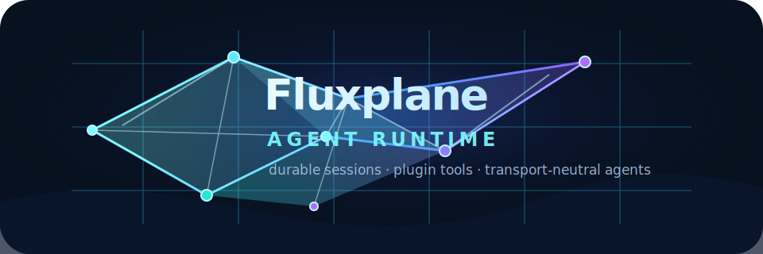

# Fluxplane Agent Runtime

<p align="center">
  
</p>

<p align="center">
  <em>A Go runtime and SDK for building safe, durable agent systems — and the <code>coder</code> terminal coding agent built on it.</em>
</p>

<p align="center">
  <a href="https://pkg.go.dev/github.com/fluxplane/agentruntime"></a>
  
  
</p>

<!-- TODO: add a terminal screenshot or asciinema cast of `coder` in action. -->

## What is this?

Fluxplane Agent Runtime gives you the building blocks for **agent systems that
keep running**: sessions you can resume, events you can replay, tools that go
through a real safety envelope, and a plugin model that lets you contribute
capabilities without forking the core — so an agent can crash, be redeployed,
or be resumed days later and pick up exactly where it left off.

It also ships **`coder`**, a terminal coding assistant built on the same
runtime, so you can use the system end-to-end on day one.

## Try the `coder` agent in 30 seconds

Requires Go 1.26+.

Install:

```bash
go install github.com/fluxplane/agentruntime/cmd/coder@latest
```

Open the REPL:

```bash
coder
```

Or run a single prompt:

```bash
coder --input "Summarize this repository"
```

Set `OPENAI_API_KEY` before running, or see the [coder guide](docs/coder.md)
for other providers.

`coder` defaults to OpenAI (`gpt-5.5`) and also supports Codex, OpenRouter,
Anthropic, Claude Code, and MiniMax. See the [coder guide](docs/coder.md) for
model selection, goal mode, and safety expectations.

## What you get

**Build agents**

- Resource-authored apps, agents, sessions, commands, operations, context
  providers, and datasource declarations.
- An IO-free SDK layer for authoring specs without pulling in runtime
  internals.
- Plugin-contributed tools, commands, datasources, context providers, and
  product capabilities.

**Run them durably**

- Durable agent sessions, run handles, semantic events, and event-backed thread
  state.
- Direct in-process and HTTP/SSE channel clients over the same session
  contract.
- Provider/model catalog integration for OpenAI, Codex, OpenRouter, Anthropic,
  Claude Code, MiniMax, and local app-defined providers.

**Stay safe by default**

- A safety envelope around shell, filesystem, network, browser, process,
  approval, and secret boundaries — not retrofitted later.
- Architecture reports and import-direction checks that keep runtime layers
  from drifting.

## Start here

- [agentsdk CLI](docs/agentsdk.md)
- [coder coding agent](docs/coder.md)
- [Configuration](docs/configuration.md)
- [Architecture](docs/architecture.md)
- [Security model](docs/security.md)
- [Changelog](CHANGELOG.md)

## Project status

This is a **pre-1.0 rewrite**. Expect breaking changes in module APIs, resource
shapes, and command surfaces. We are deliberately not shipping
backward-compatibility shims during this phase — see
[docs/migration-from-agent-sdk.md](docs/migration-from-agent-sdk.md) for
rationale.
