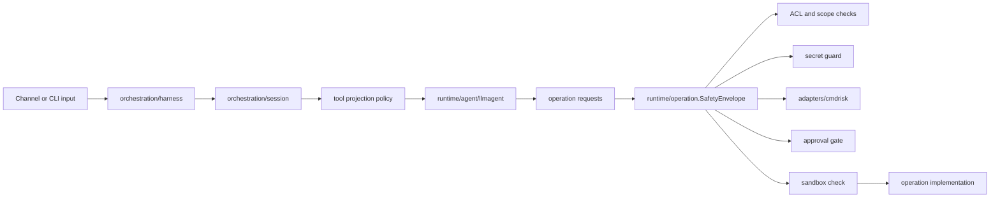
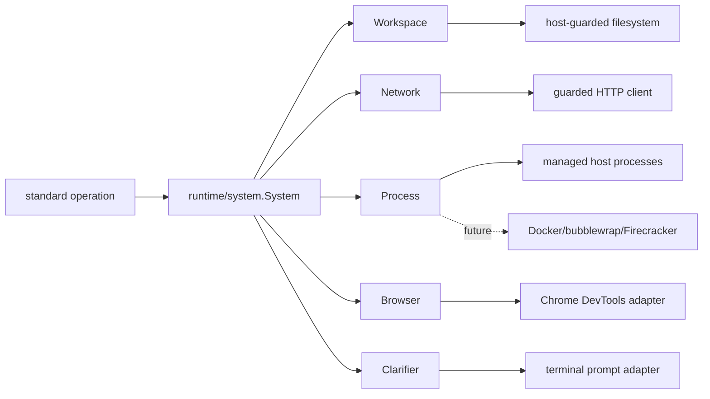
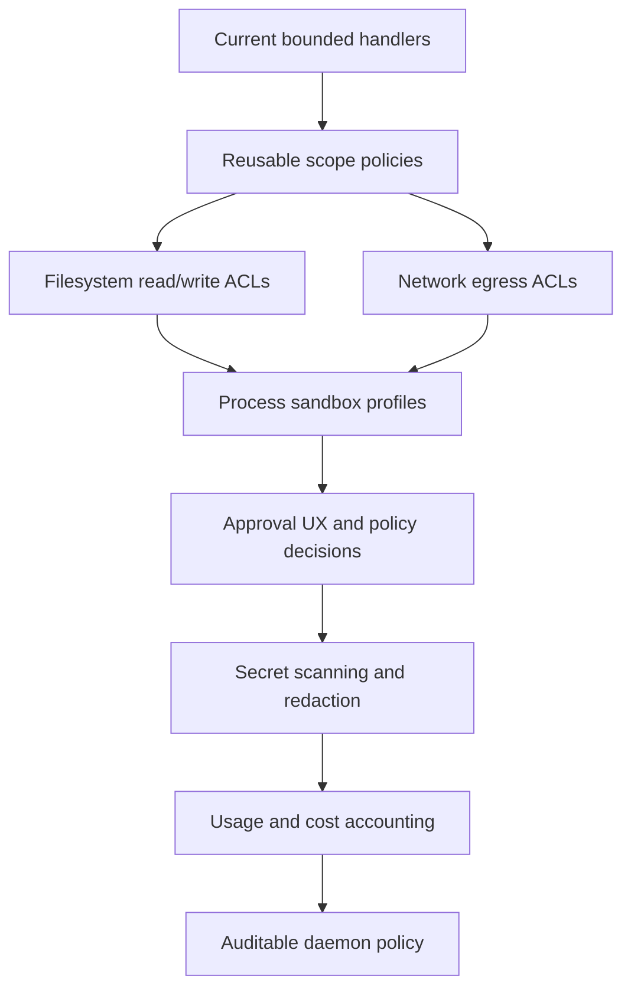

# Security Model

Fluxplane Agent Runtime treats every side effect as an operation crossing a
runtime boundary. The current implementation is intentionally conservative:
operations are projected to agents only after policy checks, then every
execution enters `runtime/operation.SafetyEnvelope` before the handler runs.

## Current Design



The safety boundary is layered:

```text
agent decision
  -> command/tool projection policy
  -> operation catalog binding
  -> runtime safety envelope
     -> ACL/scope
     -> secret guard
     -> command-risk classifier
     -> approval gate
     -> sandbox check
  -> concrete operation handler
  -> result + audit/runtime events
```

`core/operation.Semantics` describes the intrinsic operation properties:
effects, idempotency, determinism, and coarse declared risk. It does not encode
caller trust, channel exposure, or app-specific policy. Those are applied by
orchestration and runtime safety when an operation is projected or executed.

## Enforcement Shape

When operation implementations move beyond pure/in-memory examples, they must
be implemented safety-first. Shell, filesystem, network, browser, code
execution, and connector operations must not land as plain function calls with
safety retrofitted later. Every such operation must enter through
`runtime/operation.SafetyEnvelope`, and the envelope composition must cover:

- sandboxing;
- ACL and scope checks;
- command-risk classification (`codewandler/cmdrisk` or successor);
- secret handling and redaction;
- approval requirements;
- audit events;
- environment boundaries.

The first-party coder host wires `adapters/cmdrisk` for shell and structured
network intent assessment and keeps operation-local checks as defense in depth.
Do not add a new shell, filesystem, network, browser, code execution, or
connector path that bypasses the safety envelope.

## Implemented Controls

`runtime/operation.SafetyEnvelope` is the mandatory pre-execution shape for
side-effecting operations. It keeps the runtime independent of concrete safety
engines while giving hosts a single composition point for ACLs, secret guards,
risk classification, approval, and sandbox checks.

`runtime/system` is the reusable IO boundary for concrete operations. Standard
plugins receive a `System` and must use its workspace, network, process,
browser, and clarifier interfaces instead of calling `os`, `net/http`, `exec`,
or terminal input directly.



`adapters/cmdrisk` wraps `github.com/codewandler/cmdrisk`. It evaluates shell,
git, code-execution, and other process intents through command assessment,
evaluates structured network fetches through intent assessment, maps decisions
into operation risk levels, and emits `cmdrisk.assessed` events for debug and
audit streams.

The first standard coding operation batch lives behind `plugins/codingplugin`.
It aggregates filesystem, web, browser, git, shell, background process, scratch
code execution, and human clarification operations. These are contributed as
`operation.Set` groups so a capability can contain multiple atomic operations
such as `file_read`, `file_edit`, `grep`, and `browser_click`.

The host-backed filesystem boundary currently:

- resolves the workspace root through `EvalSymlinks`;
- optionally resolves explicitly configured named roots such as `@tmp/path`;
- resolves existing paths and create parents before accepting them;
- rejects symlink escapes for reads and writes;
- keeps `/tmp` denied by default unless a distribution opts into a specific
  subdirectory such as `/tmp/agentruntime-demo`;
- keeps glob expansion limited to search operations;
- emits file usage events for read/write boundaries.

The host-backed process boundary currently:

- executes direct executables, never through a shell interpreter;
- rejects shell syntax in command strings;
- separates and caps stdout/stderr;
- emits stdout/stderr process events for foreground execution;
- manages background process handles with start, list, status, output, and kill
  operations;
- reports timeout, truncation, duration, and exit code explicitly;
- uses platform-specific process cleanup helpers.

The host-backed HTTP boundary currently:

- supports bounded HTTP requests with method, headers, and body;
- enforces timeout and response body limits;
- allows only absolute `http` and `https` URLs;
- blocks loopback, private, link-local, multicast, unspecified, and metadata
  addresses unless the host explicitly allows private targets;
- resolves DNS inside a guarded dialer to reduce DNS rebinding exposure;
- revalidates redirects before following them;
- converts HTML responses to Markdown using the same
  `github.com/JohannesKaufmann/html-to-markdown/v2` library used by the old
  implementation.

`code_execute` is separate from `shell_exec`. It writes a caller-supplied file
set into an isolated scratch directory and runs a configured Docker image with
network disabled. This is a first sandbox-oriented shape, not the final process
sandbox story.

`plugins/browserplugin` exposes rewrite-native browser operations backed by a
`runtime/system.BrowserManager`. The current concrete adapter uses Chrome
DevTools Protocol and writes screenshot/PDF artifacts through the workspace
boundary. Browser URL handling is intentionally narrow: HTTP(S) or `about:blank`.

`clarify` emits typed human clarification request/completion events and uses a
`runtime/system.Clarifier`. The terminal adapter can render prompt plus JSON
Schema fields with enum/default hints and return structured answers as normal
operation results.

Conversation continuity is also part of safety. When a model response requests
operations and the turn stops before a follow-up model response, the session
persists provider-visible tool result items before returning. This prevents the
next manual turn from replaying a transcript that contains a provider tool call
without a corresponding tool result.

## Not Yet A Sandbox

The current implementation is not a full process/container sandbox. Host
filesystem, network, and process boundaries are guarded, but host shell and git
operations still run on the host. `code_execute` uses Docker when available,
but the platform still needs first-class sandbox profiles and approval UX.

Do not treat the current coder app as safe for untrusted repositories,
untrusted prompts, or untrusted users. It is a foundation for proving the
architecture and safety hooks before migrating browser, connector, and broader
code execution capabilities.

## Roadmap



Planned controls:

- `core/safety` or equivalent pure policy specs for scopes, sandbox profiles,
  approvals, and audit vocabulary once the shapes are stable.
- Reusable filesystem scopes: read roots, write roots, denied paths, symlink
  rules, and secret/sensitive path classes.
- Reusable network scopes: allowed domains, denied address ranges, connector
  endpoints, proxy policy, and redirect policy.
- Process sandbox adapters: OS sandbox profiles, containers, or restricted
  subprocess launchers depending on host capability.
- Process manager hardening: durable process ownership, attach streams,
  per-session cleanup, and sandbox-specific process launchers.
- Overlay workspace: copy-on-write filesystem operations with diff, rollback,
  and commit. Overlay guarantees only apply when mutation goes through
  `System.Workspace`; shell requires a real process sandbox to preserve them.
- Approval gates: interactive approval for high-risk operations, durable
  approval records, and app/channel-specific approval UX.
- Secret handling: pre-execution input scanning, environment filtering, output
  redaction, and provider transcript redaction.
- Usage events: file bytes read/written, network bytes, subprocess runtime,
  browser artifact bytes, LLM token usage, and cost estimation from
  provider/model catalogs.
- Daemon policy: named policy profiles for sessions started from config,
  timers, file watchers, and remote channels.

## Layer Placement

```text
core/
  Pure safety descriptors and events only after concepts are proven.

runtime/
  Safety envelope, middleware, policy evaluation, projection-safe execution.

adapters/
  cmdrisk, process/container sandboxes, HTTP/network guards, secret scanners.

orchestration/
  Session/harness policy composition, approval flow, audit persistence.

apps/
  Product-specific policy defaults and selected operation bindings.
```

No shell, filesystem, network, browser, connector, or code execution path should
bypass `runtime/operation.SafetyEnvelope`.
